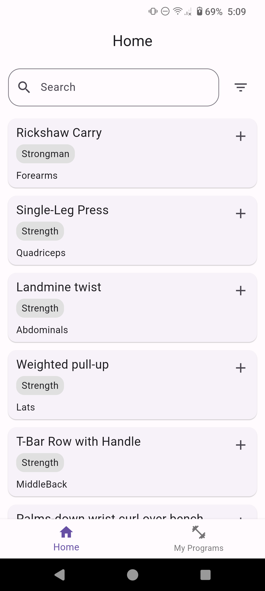
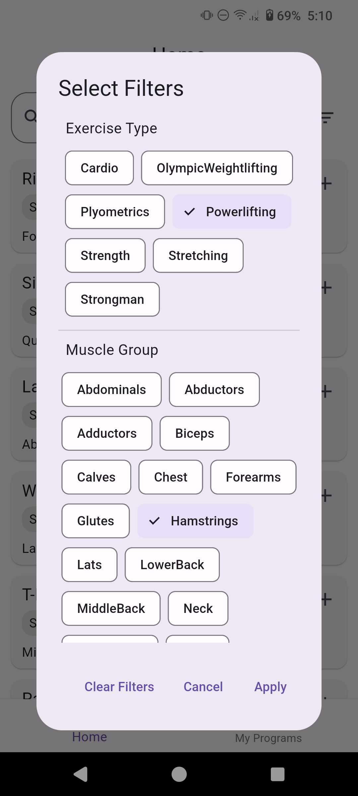
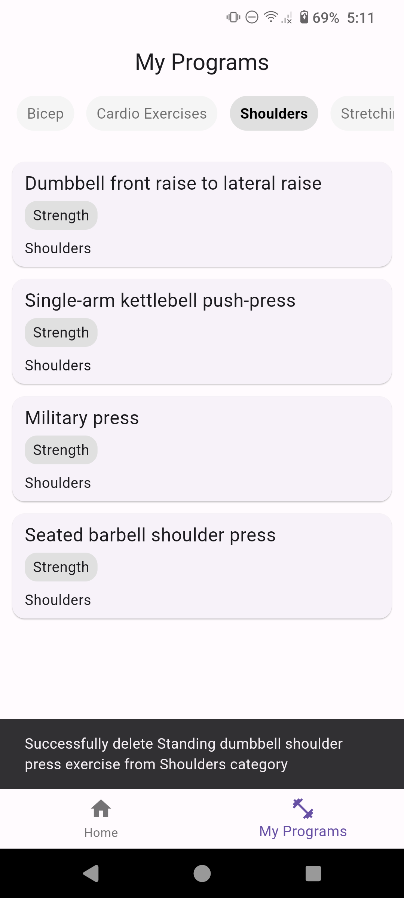
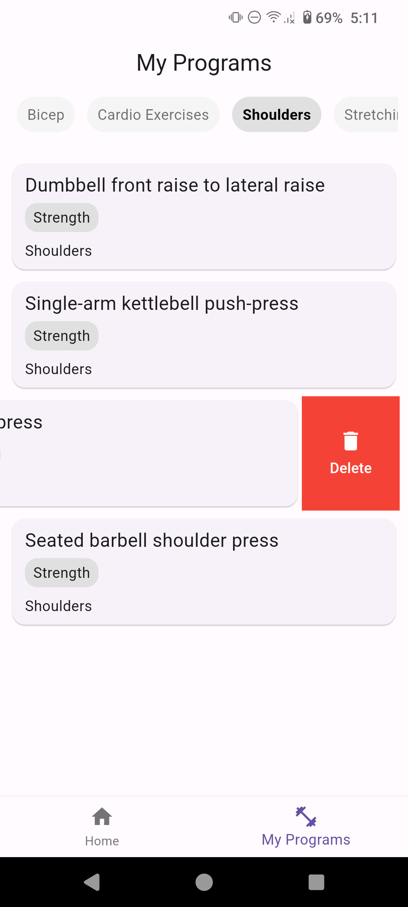

# Exercise Finder App

This is a Flutter project designed to help users find and manage exercises.

## Prerequisites

Before you begin, ensure you have met the following requirements:

- Flutter 3.16.5
- Dart 3.2.3

## Architecture

This project follows the Model-View-ViewModel (MVVM) architecture, which facilitates a clear separation of concerns by dividing the application into three main components:

- Model: The core data layer, including business logic and data models like ExerciseModel and AlertModel, managed through services such as ApiService and HiveService.

- View: The visual layer, made up of UI components that display data to users. It updates reactively based on changes in the ViewModel.

- ViewModel: The bridge between Model and View, it manages UI logic, state, and user interactions, facilitating a reactive data flow to the View.

## Project Structure

The project is organized as follows:

```sh
lib/
├── main.dart
├── model/
├── services/
├── utils/
├── view/
└── viewmodel/
```

### Key Directories:

- `model/`: Contains the data models used in the app.
- `services/`: Includes services for API communication and local storage.
- `utils/`: Utility classes such as API client setup, interceptors, and dependency injection modules.
- `view/`: UI components, including pages and widgets.
- `viewmodel/`: ViewModels that manage the state for the UI.

## Getting Started

To get a local copy up and running, follow these simple steps:

### Setup

1. **Clone the repository:**

```sh
git clone https://github.com/talhakerpicci/exercise-finder
cd exercise_finder
```

2. **Copy the .env.example file to a new file named .env and enter your api key.**

```sh
cp .env.example .env
```

3. **Install dependencies:**

```sh
flutter pub get
```

4. **Generate code:**

```sh
dart run build_runner build --delete-conflicting-outputs
```

5. **Launch the App:**

```sh
flutter run
```

Ensure to enable touch feedback in the Android settings for the best user experience.

## Screenshots






## Demo Video

For a full app walkthrough, check out the demo video below:

[](screenshots/video.mp4)
